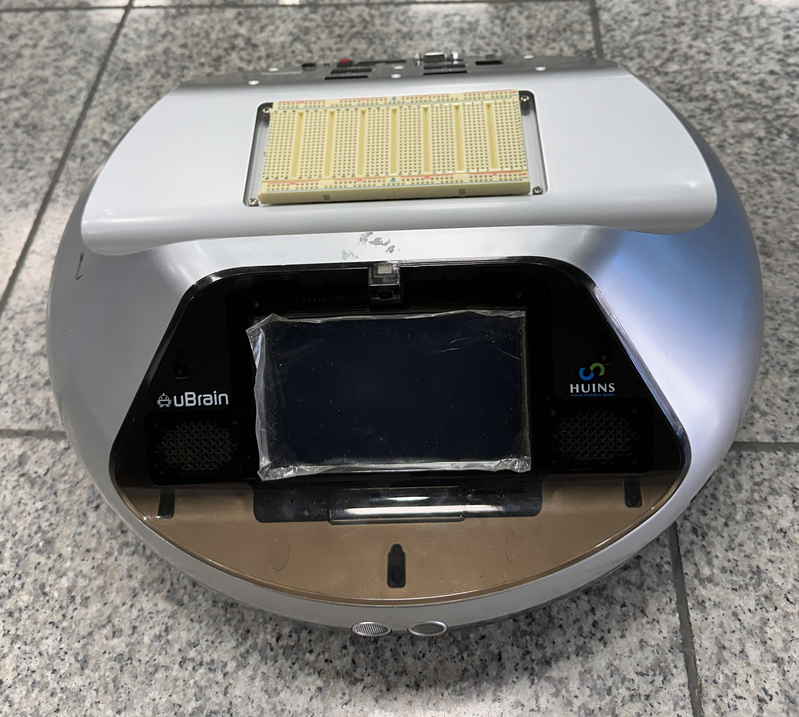
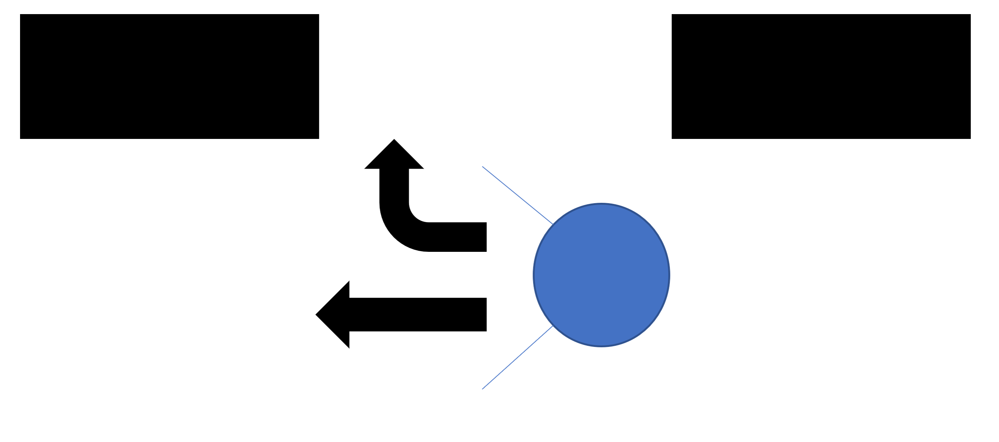
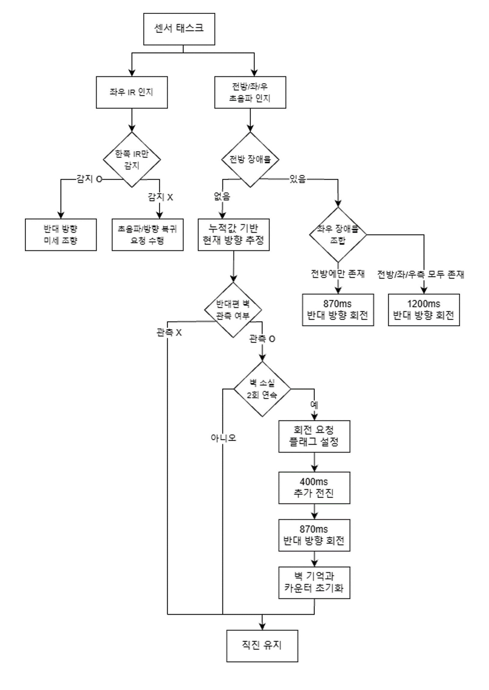

# 자율주행 임베디드 챌린지

휴인스 Ubrain 모델과 STM32F429II를 기반으로 구현한 다중 센서 자율주행 프로젝트

좌우 적외선 센서와 전방·좌·우 초음파 센서를 조합하고, FreeRTOS 태스크와 Queue를 이용해 센서 처리와 모터 제어를 분리함.

> 임베디드소프트웨어 01반 · 14팀  
> 충남대학교 컴퓨터융합학부 김우솔, 정민용

## 시연 영상

| 구분 | 링크 |
|---|---|
| 연습 주행 1 | [연습 과정에서 구성한 코스 주행](https://www.youtube.com/shorts/X7TjMowvyI4?feature=share) |
| 연습 주행 2 | [실습 코스 연습 주행](https://youtube.com/shorts/rzx_PBp4DDI?feature=share) |
| 연습 주행 3 | [평가 코스 연습 주행](https://youtube.com/shorts/xVC4OjvIfxA?feature=share) |
| 평가 코스 최종 주행 1 | * 영상 녹화 오류로 인한 연습 주행 영상 대체 (동적 장애물 충돌로 3구간 실격) |
| 평가 코스 최종 주행 2 | [지정 맵 탈출로 1구간 실격](https://youtube.com/shorts/j9KKh7JnI00?feature=share) |
| 평가 코스 최종 주행 3 | [지정 맵 탈출로 1구간 실격](https://youtube.com/shorts/MTQTegcoarQ?feature=share)|

## 개발 환경

- Board: HUINS Ubrain, STM32F429II (Cortex-M4)
- IDE/Compiler: Keil MDK-ARM uVision, ARMCC 5.06
- Framework: STM32F4 HAL, CMSIS-RTOS, FreeRTOS
- Motor control: TIM4/TIM8 PWM
- Sensors:
  - 전방·좌·우 초음파 센서 3개
  - 좌·우 적외선 센서 2개

## 주행 전략

초음파 센서는 코스의 구조를 판단하는 장거리 센서로 사용하며, 적외선 센서는 근거리 충돌을 피하기 위한 미세 조향 센서로 사용함.

1. 초음파 에코 펄스를 타이머 입력 캡처로 측정함.
2. `거리(cm) = 펄스 폭 / 58`로 환산하고, 15 cm 미만을 장애물로 판단함.
3. 좌우 IR 값을 ADC로 읽어 `100~2000` 범위로 제한한 뒤 임계값과 비교함.
4. 모터 태스크는 IR 근접 회피를 우선 처리하고, 이후 초음파 구조 및 경로 복귀 요청을 처리함.
5. 좌·우 회전의 실제 RTOS tick을 누적해 현재 진행 방향을 추정함.

전방 장애물은 좌우 초음파 상태에 따라 분류함.

| 전방 | 좌측 | 우측 | 동작 |
|---:|---:|---:|---|
| 막힘 | 열림 | 열림 | 누적 회전량의 반대 방향으로 회전 |
| 막힘 | 막힘 | 열림 | 우회전 |
| 막힘 | 열림 | 막힘 | 좌회전 |
| 막힘 | 막힘 | 막힘 | 누적 회전량의 반대 방향으로 크게 회전 |

## HeadingState 기반 방향 추정

자이로 센서 없이 좌·우 회전 시간을 누적해 로봇의 현재 주행 방향을 `HeadingState`로 관리함.

| 순회전량 | `HeadingState` | 의미 |
|---:|---|---|
| 우회전 누적량이 큼 | `HEADING_RIGHT` | 오른쪽 방향으로 주행 중 |
| 좌회전 누적량이 큼 | `HEADING_LEFT` | 왼쪽 방향으로 주행 중 |
| 좌우 누적량이 비슷함 | `HEADING_FRONT` | 초기 진행 방향으로 주행 중 |

IR 센서의 미세 조향은 방향 상태에 과도하게 반영되지 않도록 `0.24` 가중치를 적용함.

외딴 섬 구간에서는 현재 `HeadingState`를 기준으로 추적할 측면 벽과 원래 진행축으로 복귀할 회전 방향을 결정함.

### HeadingState LED 디버깅

센서 조건과 누적 회전량에 따라 방향 상태가 의도대로 전환되는지 보드 LED로 즉시 확인할 수 있도록 구성함.

| LED 표시 | `HeadingState` | 확인 목적 |
|---|---|---|
| `LED1` 점등 | `HEADING_RIGHT` | 우회전 누적량이 우측 방향 판정 기준에 도달했는지 확인 |
| `LED2`, `LED3` 점등 | `HEADING_FRONT` | 좌우 회전량이 상쇄되어 초기 진행축 허용 범위로 복귀했는지 확인 |
| `LED4` 점등 | `HEADING_LEFT` | 좌회전 누적량이 좌측 방향 판정 기준에 도달했는지 확인 |

이를 통해 외딴 섬 구간에서 벽 소실을 올바른 측면 센서로 추적하는지와 복귀 회전 후 `HEADING_FRONT`로 전환되는지를 주행 중 검증함.

## 외딴 섬 문제

이 프로젝트에서는 로봇이 벽을 따라 우회 또는 좌회한 뒤, 따라가던 벽이 끝났을 때 원래 진행축으로 복귀해야 하는 상황을 **외딴 섬 문제**로 정의함.

단순히 “옆이 비었다”는 현재 센서값만 보고 회전하면 처음부터 넓게 열린 공간도 코너로 오인해 반복 회전하게 됨. 이를 해결하기 위해 센서값의 시간적 순서를 상태로 저장함.

예를 들어 로봇이 오른쪽 방향으로 주행할 때:

1. 왼쪽 벽을 한 번 이상 감지했는지 기억함.
2. 이후 왼쪽 벽이 사라진 상태가 2회 연속 확인될 때만 복귀를 요청함.
3. 차체 중심이 코너를 통과하도록 400 ms 추가 전진함.
4. 왼쪽으로 870 ms 회전해 원래 진행축으로 복귀함.

이 방식으로 **처음부터 벽이 없는 공간**과 **벽을 따라가다가 끝을 통과한 상황**을 구분함.

## FreeRTOS 구조

| 태스크 | 역할 | 주기 |
|---|---|---:|
| `IR_Sensor` | 좌우 ADC 측정 및 근접 상태 생성 | 10 ms |
| `Detect_obstacle` | 3방향 거리 판정, 외딴 섬 상태 추적 | 50 ms |
| `Motor_control` | 센서 우선순위 판단 및 모터 동작 실행 | 상태 기반 반복 실행 |

초기에는 여러 전역 플래그를 태스크가 직접 공유했으나, 필드별 갱신 시점이 달라 서로 다른 측정 주기의 값이 섞일 수 있었음. 이를 다음 Queue 구조로 개선함.

- `irSensorQueue`: 좌우 IR 상태를 하나의 스냅샷으로 전달
- `navigationQueue`: 전방·좌·우 장애물과 복귀 요청을 하나의 메시지로 전달
- `navigationCommandQueue`: 복귀 시작/종료, ACK, 추적 상태 초기화 명령 전달

센서 Queue는 길이 1과 `xQueueOverwrite()`를 사용해 항상 최신값만 유지함. `osDelay()` 동안 태스크를 Block해 다른 센서 태스크가 실행되도록 하고, `osKernelSysTick()`으로 요청 시간이 아닌 실제 회전 경과 시간을 누적함.

## 트러블슈팅

| 문제 | 원인 | 해결 |
|---|---|---|
| 열린 공간에서 반복 회전 | 측면 개방을 즉시 코너 끝으로 판단 | 벽을 본 이력과 벽 소실 2회 연속 확인 추가 |
| 초음파 오검출 | 반사각, 간섭, 에코 미수신 | `0` 측정 제외 및 연속 확인 적용 |
| 좌우 도리도리 | IR 임계값이 낮으면 주변 반사나 먼 장애물에도 반응하고, 높으면 벽에 너무 가까워진 뒤 반응함 | `IR_THRESHOLD`를 600~700 사이에서 반복 조정해 현재 660으로 캘리브레이션함 |
| IR 누적량 과대 반영 | 90도 회전보다 IR 미세 조향 누적량이 더 커져 내부 방향 상태가 실제 차체 방향과 어긋남 | IR 미세 조향일 때만 회전 누적량에 `0.24` 가중치 적용 |
| 코너에서 차체가 벽에 걸림 | 센서와 차체 회전 중심의 위치 차이 | 복귀 전 400 ms 추가 전진 |
| 중복 복귀 동작 | 센서 태스크가 동일 요청을 반복 생성 | 요청 유지, ACK 및 `returnHandling` 상태 도입 |
| 태스크 간 상태 불일치 | 여러 전역 플래그를 개별 갱신 | 구조체 기반 FreeRTOS Queue로 교체 |

## 주요 캘리브레이션 값

현재 [`main.c`](project/RTOS/Src/main.c) 기준 값임.

| 항목 | 값 |
|---|---:|
| IR 감지 임계값 | ADC 660 |
| 초음파 장애물 거리 | 15 cm |
| IR 미세 회전 | 50 ms |
| IR 방향 누적 가중치 | 0.24 |
| 일반 방향 전환 | 870 ms |
| 삼면 장애물 회전 | 1200 ms |
| 코너 복귀 전 추가 전진 | 400 ms |
| 코너 개방 확인 | 2회 연속 |
| IR / 초음파 갱신 주기 | 10 ms / 50 ms |

## 빌드 및 실행

1. Keil uVision에서 [`Project.uvprojx`](project/RTOS/MDK-ARM/Project.uvprojx)를 엶.
2. `PWM(Motor)` 타깃을 선택함.
3. 프로젝트를 빌드한 뒤 STM32F429II 보드에 다운로드함.
4. 전원과 모터 드라이버를 연결하고 센서 임계값 및 회전 시간을 주행 환경에 맞게 확인함.
